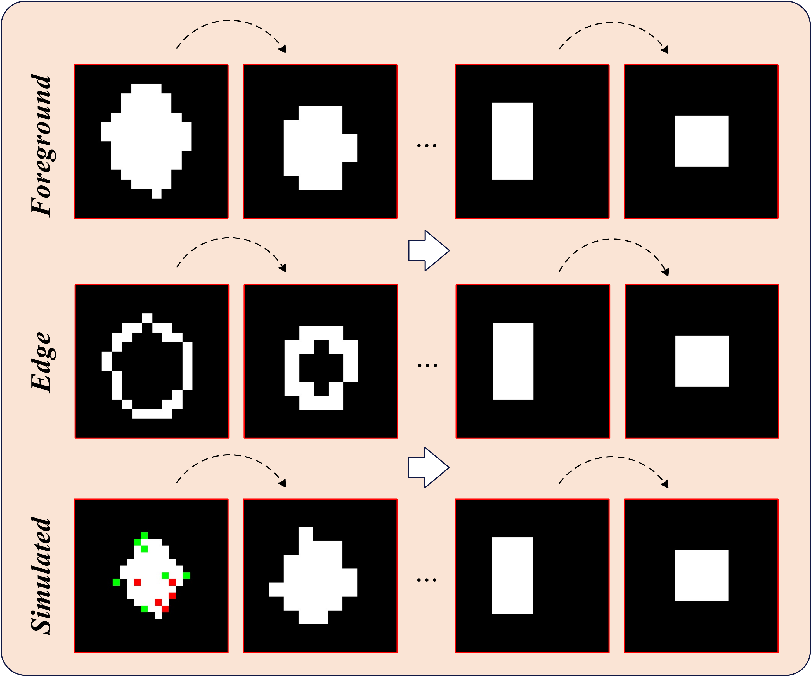

# ET-DSC

# Motivation

  

<!-- 这是一个注释 -->
<!--
Coming soon

  

-->
# Model

# ET-DSC

  

Our pre-trained model file is available at:

trained on NUDT
https://pan.baidu.com/s/1IyNp7tkGa6Kd6hLFgDNetA and the code is qqyu.

trained on NUAA
https://pan.baidu.com/s/1WpaF12ttKxoN5r1mIXFJ1g and the code is e26y.

